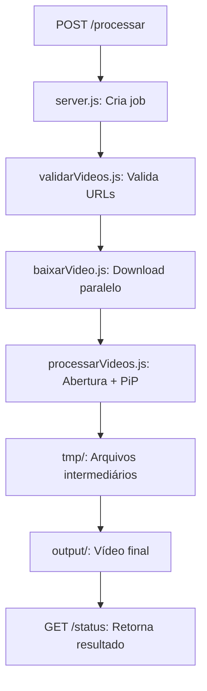

# 📁 Estrutura do Projeto - Análise Detalhada

## 🚀 Arquivos Core da API

### `server.js` - Servidor Principal
```javascript
// O coração da aplicação
```
**Função**: Servidor Express.js que gerencia toda a API de processamento de vídeos
**Responsabilidades**:
- **Recebe requisições** via POST `/processar` com nome, processo e URLs de vídeos
- **Sistema de filas assíncronas** - Evita travamentos com até 10 jobs simultâneos
- **Gerenciamento de estados**: `na_fila` → `baixando` → `processando` → `feito`/`erro`
- **Endpoints de monitoramento**: `/status/{id}`, `/jobs`, `/debug`
- **Timeouts inteligentes**: 60s download, 20min processamento
- **Event Loop não-bloqueante** - API responde durante processamento

---

### `baixarVideo.js` - Módulo de Download
```javascript
// Downloads paralelos e robustos
```
**Função**: Faz download de múltiplos vídeos simultaneamente
**Características**:
- **Downloads paralelos** com `Promise.all()`
- **User-Agent personalizado** para evitar bloqueios
- **Timeout de 30 segundos** por vídeo
- **Validação de tamanho** - rejeita arquivos muito pequenos
- **Tratamento de erros** específicos por URL
- **Streams otimizados** para arquivos grandes

---

### `processarVideos.js` - Processamento Principal ⭐
```javascript
// O módulo mais complexo - Processamento com PiP
```
**Função**: Cria vídeos de entrevista profissionais com efeitos avançados
**Funcionalidades**:

1. **Abertura Personalizada (5s)**:
   - Logo centralizado no topo
   - Nome do candidato (fonte 56px)
   - Descrição do processo (fonte 40px, 1-2 linhas)
   - Fundo branco HD 1280x720

2. **Normalização de Vídeos**:
   - Converte todos para HD 1280x720
   - 30 FPS padronizado
   - Áudio 48kHz estéreo AAC
   - Aspect ratio preservado com padding

3. **Efeito Picture-in-Picture (PiP)**:
   - **Alternância dinâmica**: Lisa (entrevistadora) ↔ Candidato
   - PiP 320x180 no canto inferior direito
   - Preview de 5s do próximo participante
   - Labels identificadores em tempo real

4. **Concatenação Final**:
   - Stream copy para máxima eficiência
   - Preserva qualidade HD original
   - Sincronização A/V perfeita

**🔄 Conversão Assíncrona**: Todos os `execSync` foram substituídos por `await execAsync` para não travar o Event Loop.

---

### `validarVideos.js` - Validação de URLs
```javascript
// Validação rápida antes do download
```
**Função**: Verifica se as URLs de vídeo são acessíveis
**Processo**:
- **HEAD requests** para verificar disponibilidade
- **Timeout de 5 segundos** por URL
- **Validação de Content-Type** (video/*)
- **Rejeita URLs inválidas** antes do download caro

---

## 🐳 Arquivos de Containerização

### `Dockerfile` - Configuração do Container
```dockerfile
# Container otimizado para FFmpeg e Node.js
```
**Componentes**:
- **Base**: `node:20` (Ubuntu)
- **FFmpeg completo** com todas as funcionalidades
- **Fontes**: Liberation, DejaVu, Noto para drawtext
- **Fontconfig configurado** para evitar erros de cache
- **ImageMagick** para criar logos temporários
- **Usuário não-root** para segurança
- **Health check** automático

**Otimizações**:
- Cache de fontes global
- Variáveis de ambiente para fontconfig
- Logo temporário via FFmpeg se não existir

---

### `docker-compose.yml` - Orquestração
```yaml
# Configuração para deployment
```
**Configurações**:
- Mapeamento de porta 3000
- Volumes para persistência (tmp, output)
- Restart automático
- Environment variables
- Network isolation

---

### `.dockerignore` - Exclusões do Build
```plaintext
# Otimização do build Docker
```
**Ignora**:
- `node_modules` (será reinstalado)
- Arquivos de teste (`test*`, `*test*`)
- Documentação (`*.md`)
- Logs e temporários
- Arquivos de desenvolvimento
- **Mantém**: `mask_circle_122.png` (essencial)

---

## 📦 Arquivos de Configuração

### `package.json` - Dependências e Scripts
```json
{
  "dependencies": {
    "express": "Servidor web",
    "uuid": "IDs únicos para jobs",
    "https": "Downloads seguros"
  }
}
```
**Scripts**:
- `npm start` → `node server.js`
- Dependências mínimas para produção

---

### `package-lock.json` - Lock de Versões
**Função**: Garante versões exatas das dependências em todos os ambientes

---

## 🎨 Arquivos de Recursos

### `mask_circle_122.png` - Máscara Circular
**Função**: Máscara PNG usada para criar o efeito circular do vídeo do candidato na abertura
**Especificações**: 
- Tamanho: 122x122px
- Formato PNG com canal alpha
- Máscara circular para sobreposição

---

## 📁 Diretórios

### `tmp/` - Arquivos Temporários
**Conteúdo**: 
- Vídeos baixados durante processamento
- Arquivos intermediários do FFmpeg
- Segmentos PiP temporários
- **Limpeza automática** após processamento

### `output/` - Vídeos Finais
**Conteúdo**:
- Vídeos processados finais (`output_UUID.mp4`)
- Prontos para download/streaming
- Nomeados com UUID único

### `node_modules/` - Dependências
**Conteúdo**: Bibliotecas Node.js instaladas via npm

---

## 🔄 Fluxo Completo do Sistema



## ⚡ Características Técnicas

### Performance:
- ✅ **Não-bloqueante**: Event Loop livre durante processamento
- ✅ **Concorrência**: Até 10 jobs simultâneos
- ✅ **Paralelização**: Downloads e processamento paralelos
- ✅ **Timeouts**: Evita travamentos infinitos

### Qualidade:
- ✅ **HD 1280x720**: Resolução profissional
- ✅ **30 FPS**: Fluidez cinematográfica  
- ✅ **Áudio AAC 48kHz**: Qualidade broadcast
- ✅ **PiP dinâmico**: Alternância inteligente

### Robustez:
- ✅ **Error handling**: Recuperação de falhas
- ✅ **Cleanup automático**: Sem lixo temporário
- ✅ **Monitoramento**: Status em tempo real
- ✅ **Docker ready**: Deploy consistente

Cada arquivo tem uma função específica e crítica no funcionamento do sistema de processamento de vídeos! 🎬
